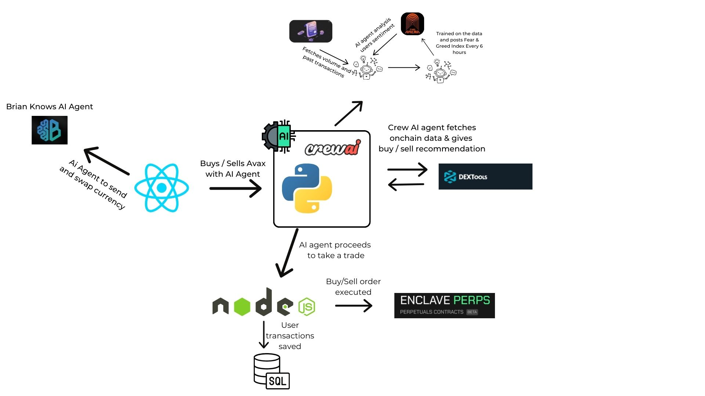

  
Bounty9000

  Frontend: A React application for building a responsive and interactive user interface.
  Backend: A Node.js application with a MySQL database for handling server-side logic and API requests.
  AI-Agent: A Python-based module for AI functionalities and integrations.

  Folder Structure

  ├── frontend/   # React application for the user interface  
  ├── backend/    # Node.js application with MySQL database  
  └── ai-agent/   # Python-based AI agent for advanced functionalities

  Setup

  Prerequisites

  ## **Generating an Enclave API Key**

To generate an API Key For Enclave Market

1. Sign into your account with a web browser at [`https://sandbox.enclave.market/`](https://sandbox.enclave.market/)
2. Click on your address in the upper right corner
3. Click "API Keys”
4. Click Add New API Key
5. Name the key
6. Select the correct permissions
7. Click "Create API Key”
8. Record the secret key
9. Save it in /backend/.env file

*Important: The secret key should be treated the same way as a password and not stored in an unencrypted manner. Please place this information in a password manager or key vault.*

## **Obtaining a Bearer Token for Arena Social**
To obtain a Bearer Token for Arena Social, follow these steps:

1.Log into Arena Social
  Use a web browser to sign into your account at https://arena.social/home.

2.Open the Developer Tools

  Right-click anywhere on the page and select "Inspect", or press Ctrl+Shift+I (Windows/Linux) or Cmd+Option+I (Mac).
  Navigate to the "Application" tab in the Developer Tools.

3.Locate the Bearer Token

  In the left-hand menu, find the "Storage" section and select "Cookies".
  Choose the domain corresponding to Arena Social (e.g., social.arena). 
  Look through the cookies for a key like Authorization or Bearer.

4.Copy the Token
  Copy the token value directly from the cookies or local storage.
  The token should begin with Bearer.
  
5.Securely Store the Token
  Save the token in your /backend/.env file or another secure location.

  ## ** OPEN AI API key to get the bot running **

1. Go to platform.openai.com
2. API keys > Create new secret key
3. cd ai-agent/.env - paste your api key

Note - check the credits in your account if they credits are 0, will have to purchase 5$ of credits for bot to run.

   ## **Ensure you have the following installed:**

  Node.js (version >= 18)
  MySQL (latest version)
  Python (version >= 3.8)
  npm for package management

  Installation

  1. Clone the repository:
    git clone https://github.com/your-repo/project-name.git  
    cd project-name

  2. Setup the frontend:
    cd frontend  
    npm install  
    npm start

    Runs on port 3000

  3. Setup the backend:
    cd backend  
    npm install  
    node index.js

    Runs on port 3003

    Note - create a database name avax-house

  4. Setup the AI-Agent:
    cd ai-agent
    python3 -m venv .venv
    pip3 install -r requirements.txt

    source .venv/bin/activate
    flask run - to start the application.

    Runs on port 5000

  Note - 
  1. Make sure to keep all the projects running parallely
  2. Have a open ai key
  3. Add the required keys in all projects .env file for the project to execute.

  Usage
  Start the frontend, backend, and AI-agent.
  Open your browser and navigate to http://localhost:3000 to view the application.

  ## **Our Basic Architecture**
  
  

